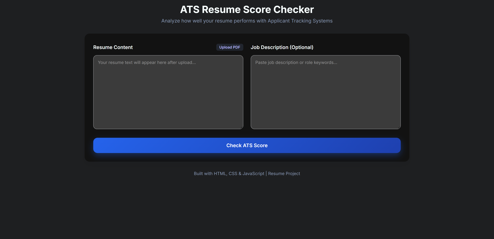

# 📄 ATS Resume Tracker

A browser-based ATS (Applicant Tracking System) Resume Score Checker that analyzes your resume against a job description and gives you a keyword match score — entirely client-side, no backend needed.

> 🖥️ Runs locally — see setup instructions below.

---

## 📸 Screenshots

> 

---

## ✨ Features

- 📤 **Upload Resume** — Accepts PDF resumes directly in the browser
- 📝 **Paste Job Description** — Enter any JD to compare against
- 🔎 **Keyword Extraction** — Automatically extracts relevant keywords from the JD
- 📊 **ATS Match Score** — Calculates a percentage match between your resume and JD
- ✅ **Matched Keywords** — Shows which keywords your resume already contains
- ❌ **Missing Keywords** — Highlights keywords your resume is missing
- 💡 **Improvement Suggestions** — Recommends what to add to improve your score
- ⚡ **Fully Client-Side** — No data is uploaded to any server; everything runs in your browser
- 📱 **Responsive UI** — Works on desktop and mobile

---

## 🛠️ Tech Stack

| Technology     | Purpose                            |
|----------------|------------------------------------|
| HTML5          | Application structure              |
| CSS3           | UI design and layout               |
| JavaScript     | Keyword extraction & scoring logic |
| PDF.js (CDN)   | Extracts text from uploaded PDFs   |

> Built as a **single HTML file** — no build tools, no dependencies to install.

---

## 🚀 Getting Started

### Run Locally

```bash
git clone https://github.com/TharunaBandi/resume-tracker.git
cd resume-tracker/Resume\ Tracker
```

Then simply open `index.html` in your browser — that's it! No build tools or installations needed.

---

## 📖 How It Works

1. **Upload** your resume in PDF format
2. **Paste** the job description you're applying for
3. Click **Analyze**
4. PDF.js extracts the text from your resume
5. The app compares resume text against JD keywords
6. You get an **ATS score**, matched keywords, and missing keywords

---

## 💡 Why This Project?

Many companies use ATS software to filter resumes before a human ever reads them. This tool helps job seekers understand how well their resume matches a job description and what keywords to add to improve their chances of getting past automated screening.

---

## 👩‍💻 Author

**Bandi Tharuna Sri**
- GitHub: [@TharunaBandi](https://github.com/TharunaBandi)
- Email: banditharuna@gmail.com
